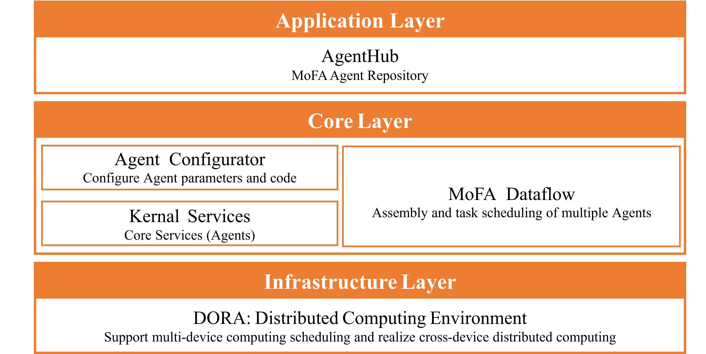
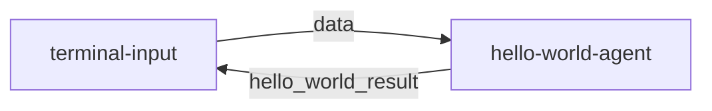

This repo is deprecated, please go to [MoFA](https://github.com/mofa-org/mofa)

# **1. MoFA Development Framework**

[English](README.md) | [Simplified Chinese](README_cn.md)

## **1.1 Core Framework Core Framework Manual**  

### **1.1.1 Design Philosophy**

MoFA is a software framework for building AI agents in a composable manner. With MoFA, AI agents can be constructed through templates and combined in a stacked way to form more powerful Super Agents.

MoFA's unique design philosophies are:

- **Ordinary People, Extraordinary Things**: AI should not be the exclusive domain of elites and giants. MoFA enables everyone to harness and develop AI, turning the impossible into possible, allowing ordinary people to create extraordinary things.
- **Composition AI**: Inspired by Unix philosophy, MoFA takes "composition" as its core principle. You can build agents, connect agents, and integrate tools like building blocks, making AI simple, flexible, and powerful.
- **Everything Agent**: Unlike most software, in the MoFA world, agents are the applications of the AI era. Not just large language models, they can be code, scripts, APIs, or even MoFA itself. MoFA is not just a framework, but an agent ecosystem.
- **Data Flow**: Most agent frameworks rely on complex WorkFlows, while MoFA chooses a more intuitive and powerful Data Flow approach. This allows agents to be freely combined, disassembled, and reused.

### **1.1.2 Technical Architecture Diagram**

  

# 2. **Quick Start Guide**

## **2.1 Development Environment Preparation**

### 2.1.1 Python Environment

First, we need to create a clean Python environment.

```bash
# Create venv
python3 -m venv .mofa
# Activate venv
source .mofa/bin/activate
```

### **Note**:
- If you don't create a virtual environment, your local Python environment must be clean, without multiple Python versions, otherwise it may cause conflicts between the Dora-rs runtime environment and the Mofa installation environment.
- Please do not use Anaconda, as the default conda repository does not have mofa-ai.
- Requires Python 3.10 or 3.11.
- We have tested on WSL (Ubuntu 22.04) and macOS. Windows is not currently supported.

### 2.1.2 Rust Environment

```bash
# Install Rust
curl --proto '=https' --tlsv1.2 -sSf https://sh.rustup.rs | sh
# When prompted, press enter directly
# Install Dora command-line tool
cargo install dora-cli

# Verify installation
rustc --version
cargo --version
dora --version
```

## 2.2 Install MoFA

### 2.2.1 Pypi Install Mofa

```bash
# Clone the repository, takes 3-4 minutes
pip install mofa-ai
# Verify installation
pip show mofa-ai
```

## **2.3 Run Your First Hello World**
```bash
git clone git@github.com:mofa-org/mofa.git
```
### 2.3.1 Start the Data Flow

```bash
cd mofa/examples/hello_world
# Start Dora service
dora up

# Build and run data flow
dora build hello_world_dataflow.yml
dora start hello_world_dataflow.yml
```

### 2.3.2 Test Interaction

```bash
# Open a new terminal
# Activate the same virtual environment
source .mofa/bin/activate

# Run input node in another terminal
terminal-input
```

Sample interaction result:

```
root@root hello_world % terminal-input                                           
 Send Your Task :  Hello
-------------hello_world_result---------------    
Hello 
```
### 2.3.3 Common Installation and Build Issues
- ModuleNotFoundError: No module named 'dora'
  Please execute these two commands:
    ```bash
    which pip
    which python
    ```
    Check if the paths of pip and python are consistent, both from the created virtual environment, usually /root/your-folder/.mofa/bin/python


- RuntimeError: Could not setup node from node id. Make sure to have a running dataflow with this dynamic node

    Caused by:
        failed to get node config from daemon: multiple dataflows contain dynamic node id terminal-input. Please only have one running dataflow with the specified node id if you want to use dynamic node
    This is because multiple dora processes are running, please execute:
    ```bash
    pkill dora
    ```
    Then restart from starting the Dora service

## **2.4 Develop Your First Application in 6 Minutes**

This guide will help you quickly create an Agent based on a large language model, following the simple implementation of hello-world.
Reference file structure configuration:
```tree
.
└── mofa/
    ├── examples/
    │   └── my_llm_agent/
    │       ├── .env.secret
    │       ├── logs
    │       ├── my_llm_dataflow.yml
    │       └── out
    ├── node-hub/
    │   └── terminal-input/
    │       ├── README.md
    │       ├── pyproject.toml
    │       ├── terminal_input/
    │       │   ├── __init__.py
    │       │   └── main.py
    │       └── tests/
    │           └── test.py
    ├── agent-hub/
    │   └── my_llm_agent/
    │       ├── .gitignore
    │       ├── README.md
    │       ├── pyproject.toml
    │       ├── my_llm_agent
    │       │   ├── __init__.py
    │       │   ├── __pycache__
    │       │   │   ├── __init__.cpython-310.pyc
    │       │   │   └── main.cpython-310.pyc
    │       │   ├── configs
    │       │   │   └── agent.yml
    │       │   └── main.py
    │       └── tests
    │            ├── __pycache__
    │            │   └── test_main.cpython-310.pyc
    │            └── test_main.py
    └── README.md
```

### 2.4.1. Configure Environment Variables (1 minute)

Create a `.env.secret` file in the example folder
(Should be created in the same directory as Dataflow.yml, in this example: mofa/examples/my_llm_agent)  

Write the following content into the .env.secret file:
Note: Replace LLM_API_KEY\LLM_API_BASE\LLM_MODEL with your model information

```plaintext
LLM_API_KEY=your_api_key_here
LLM_API_BASE=https://api.openai.com/v1  # or other API addresses
LLM_MODEL=gpt-3.5-turbo  # or other model names
```

### 2.4.2. Create Agent Project (1 minute)
Create a new Agent using MoFa CLI:

```bash
# Create a new Agent project in the agent_hub directory (in this example: mofa/agent_hub)
mofa new-agent my_llm_agent
cd my_llm_agent
```

### 2.4.3. Configure Agent Basic Information (1 minute)

Modify pyproject.toml in the agent-hub example folder  
(In this example: mofa/agent-hub/my_llm_agent/pyproject.toml):

```toml
#openai
[tool.poetry]
name = "my_llm_agent"
version = "0.1.0"
authors = [
    "youremail@outlook.com",
]
description = "An OpenAI LLM agent for MoFA"
license = "MIT"
homepage = "https://github.com/your-org/my_llm_agent"
readme = "README.md"
packages = [{ include = "my_llm_agent" }]

[tool.poetry.dependencies]
python = ">=3.10,<3.12"
openai = "*"
python-dotenv = "*"

[tool.poetry.scripts]
my_llm_agent = "my_llm_agent.main:main"

[build-system]
requires = ["poetry-core>=1.8.0"]
build-backend = "poetry.core.masonry.api"
```

### 2.4.4. Implement Agent Logic (2 minutes)

Create main.py in the agent-hub example folder
(In this example: mofa/agent-hub/my_llm_agent/main.py):

```python
# Taking openai as an example
import os
from dotenv import load_dotenv
from mofa.agent_build.base.base_agent import MofaAgent, run_agent


def call_openai_directly(user_input: str) -> str:
    import openai
    client = openai.OpenAI(
        api_key=os.getenv('LLM_API_KEY'),
        base_url=os.getenv('LLM_API_BASE')
    )

    response = client.chat.completions.create(
        model=os.getenv('LLM_MODEL', 'gpt-3.5-turbo'),
        messages=[
            {"role": "system", "content": "You are a helpful AI assistant."},
            {"role": "user", "content": user_input}
        ],
        stream=False
    )
    return response.choices[0].message.content


@run_agent
def run(agent: MofaAgent):
    try:
        load_dotenv('.env.secret')
        user_input = agent.receive_parameter('query')
        agent.write_log(message=f"Received input: {user_input}")

        agent.write_log(message="Handing over to isolated OpenAI function...")
        llm_result = call_openai_directly(user_input)
        agent.write_log(message=f"Received result from isolated function: {llm_result}")
        
        agent.send_output(
            agent_output_name='llm_result',
            agent_result=llm_result
        )
    except Exception as e:
        error_message = f"An exception occurred: {str(e)}"
        
        # Use MofaAgent's correct logging method
        agent.write_log(message=error_message, level='ERROR')
        
        # Also send this error message out
        agent.send_output(
            agent_output_name='llm_result',
            agent_result=error_message
        )

def main():
    agent = MofaAgent(agent_name='my_llm_agent')
    run(agent=agent)

if __name__ == "__main__":
    main()
```

**Tip**:
- Ensure that the case files are not placed in the same folder as the dataflow. Keep them in separate directories.

### 2.4.5 Create Data Flow Configuration (1 minute)
Create my_llm_dataflow.yml in the example folder  
(Created in the same directory as the .env.secret file, in this example: mofa/examples/my_llm_agent/my_llm_dataflow.yml)
yaml
```yaml
nodes:
  - id: terminal-input
    build: pip install ../../node-hub/terminal-input
    path: dynamic
    outputs:
      - data
    inputs:
      agent_response: my_llm_agent/llm_result

  - id: my_llm_agent
    build: pip install ../../agent-hub/my_llm_agent
    path: my_llm_agent
    outputs:
      - llm_result
    inputs:
      query: terminal-input/data
    env:
      IS_DATAFLOW_END: true
      WRITE_LOG: true
```

### 2.4.6. Run and Test
Ensure you are in the example folder, then execute the following commands  
(In this example: mofa/examples/my_llm_agent)
```bash
# Start data flow
dora up
dora build my_llm_dataflow.yml
dora start my_llm_dataflow.yml

# Test in a new terminal
terminal-input
```

### 2.4.7.  Common Installation and Build Issues
1. Process Congestion Issues
    - If there's no response for a long time after entering terminal-input in a new terminal or after a conversation, accompanied by:
        ```bash
        terminal-input: INFO   daemon    node is ready
        INFO   daemon    all nodes are ready, starting dataflow
        ```
        And the main terminal outputs this many times, like:
        ```bash
        (.mofa) root@danana:~/mofa-nana/examples/my_llm_agent# dora start my_llm_dataflow.yml
        dataflow start triggered: 0199584b-c209-76a3-9886-12e7309ac3f0
        attaching to dataflow (use `--detach` to run in background)
        my_llm_agent: INFO   daemon    node is ready
        INFO   daemon    all nodes are ready, starting dataflow
        terminal-input: INFO   daemon    node is ready
        INFO   daemon    all nodes are ready, starting dataflow
        terminal-input: INFO   daemon    node is ready
        INFO   daemon    all nodes are ready, starting dataflow
        ```
        It might be process congestion. Please clean up processes.  
Normally, the output should look like this. If not, clean up processes manually:
        ```bash
        (.mofa) root@danana:<del>/mofa-nana/examples/my_llm_agent# ps aux | grep my_llm_agent
        ps aux | grep dora
        ps aux | grep terminal-input
        root 211077 0.0 0.0 4028 2304 pts/0 S+ 23:37 0:00 grep --color=auto my_llm_agent
        root 211079 0.0 0.0 4028 2304 pts/0 S+ 23:37 0:00 grep --color=auto dora
        root 211081 0.0 0.0 4028 2304 pts/0 S+ 23:37 0:00 grep --color=auto terminal-input
        ```
2. Dependency Installation Issues

    After executing the forced reinstall command for the following issues, please do not execute dora build again, directly proceed with dora start.
    - ERROR: Could not install packages due to an OSError: [Errno 2] No such file or directory: '/root/mofa_last/.mofa_last/bin/terminal-input'
        ```bash
        pip install --force-reinstall --no-deps ../../node-hub/terminal-input
        ```
    - ERROR: Could not install packages due to an OSError: [Errno 2] No such file or directory: '/root/mofa_last/.mofa_last/bin/my_llm_agent'
    Please execute:
        ```bash
        pip install --force-reinstall --no-deps ../../agent-hub/my_llm_agent
        ```
    - [ERROR]
        failed to build node `terminal-input`

        Caused by:
        0: build command failed
        1: build command `pip install ../../node-hub/terminal-input` returned exit status: 1

        Location:
            libraries/core/src/build/build_command.rs:79:24
        ```bash
        pip install --force-reinstall --no-deps ../../node-hub/terminal-input
        ```
    - [ERROR]failed to build node `my_llm_agent`

        Caused by:
        0: build command failed
        1: build command `pip install ../../agent-hub/my_llm_agent` returned exit status: 1

        Location:
            libraries/core/src/build/build_command.rs:79:24
        ```bash
        pip install --force-reinstall --no-deps ../../agent-hub/my_llm_agent
        ```


### 2.4.8. Code Explanation

1. **Using Decorators**
   - The `@run_agent` decorator simplifies the code structure.
   - It handles loops and exceptions automatically.

2. **Simple Input and Output**
   - Receives a single input parameter `query`.
   - Returns a single output result `llm_result`.

3. **Error Handling**
   - Uses `try-except` to catch exceptions.
   - Logs errors and returns error messages to the user.

### 2.4.9. Custom Options

1. **Modify System Prompt**

```python
messages=[
    {"role": "system", "content": "Your custom system prompt"},
    {"role": "user", "content": user_input}
]
```

2. **Switch LLM Providers**
   - Modify the API configuration in `.env.secret`.
   - Adjust model parameters as needed.

### 2.4.10. Notes

1. Ensure `.env.secret` is added to `.gitignore`.
2. Keep API keys secure.
3. Keep the code structure simple and clear.

## **2.5 Data Flow Detailed Explanation**

(Using the hello-world example)

### 2.5.1. Data Flow Process



The data flow consists of two nodes:
1. **terminal-input**: The terminal input node, responsible for receiving user input.
2. **hello-world-agent**: The agent node, responsible for processing the input and returning the result.

### 2.5.2. Node Features
Each node is multi-input, multi-output, and supports continuous streaming:
- **Input/Output Flow**: Similar to OpenAI's stream mode.
- **Dynamic Processing**: Inputs and outputs are dynamically controlled via code.
- **Bidirectional Communication**: Nodes can send messages to each other.

### 2.5.3. Key Configuration Explanation

#### 2.5.3.1 IS_DATAFLOW_END

```yaml
env:
  IS_DATAFLOW_END: true
```
- Marks whether the current node is the last one in the data flow.
- When this node sends a message, it signifies the end of the entire process.
- The process will restart automatically after the flow ends.

#### 2.5.3.2 WRITE_LOG

```yaml
env:
  WRITE_LOG: true
```
- Enables logging.
- Logs all inputs and outputs of the current node.
- Logs are saved in the `logs/` directory.
- Log format:
  ```log
  2025-03-06 11:31:14,172 - INFO: "hello-world receive data: hello"
  2025-03-06 11:31:14,173 - INFO: "output name: hello_world_result output data: hello"
  ```

### 2.5.4. Data Flow Example

```yaml
nodes:
  - id: terminal-input
    build: pip install -e ../../node-hub/terminal-input
    path: dynamic
    outputs: 
      - data
    inputs:
      agent_response: hello-world-agent/hello_world_result

  - id: hello-world-agent
    build: pip install -e ../../agent-hub/hello-world
    path: hello-world
    outputs: 
      - hello_world_result
    inputs:
      query: terminal-input/data
    env:
      IS_DATAFLOW_END: true
      WRITE_LOG: true
```

### 2.5.5. Detailed Processing Flow
1. User inputs data through terminal-input.
2. terminal-input sends data to hello-world-agent.
3. hello-world-agent processes data and returns the result.
4. The result is sent back to terminal-input for display.
5. Since IS_DATAFLOW_END=true, the process ends and restarts.

### 2.5.6. Log File Locations
- `logs/log_hello-world-agent.txt`: Agent runtime logs.
- `logs/dora-coordinator.txt`: Coordinator logs.
- `logs/dora-daemon.txt`: Daemon logs.

### 2.5.7. Best Practices
1. Use WRITE_LOG for debugging data flows.
2. Set IS_DATAFLOW_END appropriately to control process termination.
3. Ensure input and output parameter types are consistent.
4. Use environment variables to control debugging modes.
5. Clean up old logs in the `logs/` directory regularly.

# **3. Advanced Development Manual**

## 3.1 **Build Custom Agents**

### 3.1.1 Create with Template

```bash
mofa new-agent you_agent_name
```

**Tip**:
- You can use `mofa new-agent --help` to view related options for creating agents.

### 3.1.2 Project Structure

```
my-new-agent/
├── my-new-agent/
│   ├── configs/
│   │   └── agent.yml       # Configuration file
│   ├── main.py             # Main program
│   └── __init__.py
├── tests/
│   └── test_main.py        # Test code
├── pyproject.toml          # Dependency configuration
└── README.md               # Project documentation
```

### 3.1.3 Core Code Example

```python
from mofa.agent_build.base.base_agent import MofaAgent, run_agent

@run_agent
def run(agent: MofaAgent):
    try:
        # Receive single agent input
        task = agent.receive_parameter('task')
        
        # Receive multiple agent inputs
        receive_datas = agent.receive_parameter(['example_one','example_two'])
        # Result will be {'example_one':'example_one_data','example_two':'example_two_data'}

        # Processing logic here
        result = process_task(task)
        
        # Send output. Ensure the output is serializable (like a string).
        agent.send_output(
            agent_output_name='agent_result',
            agent_result=result
        )
        
    except Exception as e:
        agent.logger.error(f"Error: {str(e)}")
        

def process_task(data: str) -> str:
    """Example processing function"""
    return f"Processed: {data}"

def main():
    agent = MofaAgent(agent_name='my-new-agent')
    run(agent=agent)

if __name__ == "__main__":
    main()
```


## Star History

[](https://www.star-history.com/#mofa-org/mofa&Date)
