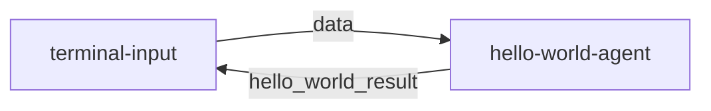

# **1、MoFA开发框架**

[English](README.md) | [简体中文](README_cn.md)

## **1.1  框架核心手册**  

### **1.1.1 设计理念**

MoFA是一个以组合的方式构建AI智能体的软件框架。使用MoFA，AI智能体可以通过模版方式构建，堆叠的方式组合，形成更强大的超级智能体（Super Agent)。

MoFA 独特的设计类理念是：

- **平凡人做非凡事**：AI 不该是精英和巨头的专属领地。MoFA 让每个人都能驾驭和发展 AI，把不可能变成可能，让平凡人也能创造非凡。
- **Composition AI**：受 Unix 哲学启发，MoFA 以“组合”作为核心原则。你可以像搭积木一样，构建智能体、连接智能体、集成工具，让 AI 变得简单、灵活、强大。
- **Everything Agent**：与绝大多数软件不同，在 MoFA 的世界里，智能体（Agent）就是 AI 时代的应用（Application）。不仅是大语言模型，它可以是代码、脚本、API，甚至是 MoFA 本身。MoFA 不是一个框架，而是一个 Agent 生态。
- **Data Flow**：大多数智能体框架依赖复杂的工作流（WorkFlow），而 MoFA 选择更直观、更强大的数据流（Data Flow）。这种方式让智能体能自由组合、拆解和重用，

### **1.1.2 技术架构图**


# 2. **快速上手指南**

## **2.1 开发环境准备**

### 2.1.1 Python 环境

首先我们需要创造一个纯净的python环境。

```bash
# 创建venv
python3 -m venv .mofa
# 激活venv
source .mofa/bin/activate
```

### **注意**: 
- 如果不建立虚拟环境，本地python环境一定要纯净，不要存在多个python版本，否则容易导致Dora-rs运行环境和Mofa安装环境的冲突。
- 请不要使用Anaconda，默认的conda库里没有mofa-ai
- 要求python环境为3.10或3.11。
- 我们目前已在 WSL（Ubuntu 22.04）和 macOS 上进行了测试。Windows 目前不支持。

### 2.1.2 Rust 环境
```bash
# 安装 Rust
curl --proto '=https' --tlsv1.2 -sSf https://sh.rustup.rs | sh
# 出现选择后，直接按enter
# 安装 Dora 命令行工具
cargo install dora-cli

# 验证安装
rustc --version
cargo --version
dora --version
```

## 2.2 安装 MoFa

```bash
# 克隆仓库,大约需要5mins
pip install mofa-ai
# 验证安装
pip show mofa-ai
```

## **2.3 运行第一个Hello World**
```bash
git clone git@github.com:mofa-org/mofa.git
```

### 2.3.1 启动数据流
```bash
cd mofa/examples/hello_world
# 启动 Dora 服务
dora up

# 构建并运行数据流
dora build hello_world_dataflow.yml
dora start hello_world_dataflow.yml
```

### 2.3.2 测试交互
```bash
# 打开一个新终端
# 同样进入创建的虚拟环境
source .mofa/bin/activate

# 在另一个终端运行输入节点
terminal-input


# 如果出现
ModuleNotFoundError: No module named 'dora'
#请执行这两句命令
which pip
which python
# 请检查pip和python的路径是否一致，都来自创建的虚拟环境，一般为/root/你的文件夹/.mofa/bin/python

# 如果出现这个问题
RuntimeError: Could not setup node from node id. Make sure to have a running dataflow with this dynamic node

Caused by:
    failed to get node config from daemon: multiple dataflows contain dynamic node id terminal-input. Please only have one running dataflow with the specified node id if you want to use dynamic node
# 是因为有多个dora进程在运行
pkill dora
# 然后重新从启动Dora服务开始运行


# 输入测试数据
> hello
# 预期输出: hello
```
交互结果示例：

```
root@root hello_world % terminal-input                                           
 Send You Task :  你好
-------------hello_world_result---------------    
你好 
---------------------------------------  
 Send You Task :  你是谁   
-------------hello_world_result---------------    
你是谁    
---------------------------------------
```

```base
# 为保证dora进程不残留影响使用
dora destroy
```

## **2.4 5分钟开发第一个应用**


本指南将帮助你快速创建一个基于大语言模型的Agent，遵循hello-world的简单实现方式。

### 2.4.1. 创建Agent项目 (1分钟)
可参考的文件架构配置
```tree
.
└── mofa/
    ├── .mofa/
    │   ├── bin/
    │   │   ├── python
    │   │   └── pip
    │   └── lib/
    │       └── python3.10/
    ├── examples/
    │   ├── hello_world/
    │   │   ├── README.md
    │   │   ├── hello_world_dataflow-graph.html
    │   │   ├── hello_world_dataflow.yml
    │   │   ├── logs
    │   │   └── out
    │   └── my_llm_agent/
    │       └── .env.secret
    ├── node-hub/
    │   └── terminal-input/
    │       ├── terminal_input/
    │       │   ├── __init__.py
    │       │   └── main.py
    │       ├── tests/
    │       │   └── test.py
    │       ├── README.md
    │       └── pyproject.toml
    ├── agent-hub/
    │   ├── hello-world/
    │   │   ├── hello_world/
    │   │   │   ├── __init__.py
    │   │   │   └── main.py
    │   │   ├── tests/
    │   │   │   └── test_main.py
    │   │   ├── README.md
    │   │   └── pyproject.toml
    │   └── my_llm_agent/
    └── README.md
```

### 2.4.2. 配置环境变量 (1分钟)

在example的本例文件夹下创建 `.env.secret` 文件
（需在Dataflow.yml目录同级进行创建，本例中为mofa/examples/my_llm_agent）

将以下内容写入`.env.secret`文件

注意要将LLM_API_KEY\LLM_API_BASE\LLM_MODEL替换为你的模型信息
```plaintext
LLM_API_KEY=your_api_key_here
LLM_API_BASE=https://api.openai.com/v1  # 或其他API地址
LLM_MODEL=gpt-3.5-turbo  # 或其他模型名称
```
```plaintext
# Qwen API 密钥（从通义千问平台获取）
LLM_API_KEY=你的Qwen_API密钥
# Qwen 模型名称（如 qwen-turbo、qwen-plus 等，根据需求选择）
LLM_MODEL=qwen-turbo # 或其他模型名称
# LLM_API_BASE 对于 Qwen 不是必需的，因为通过 dashscope 已指定服务端，若有特殊部署可按需配置
LLM_API_BASE=https://dashscope.aliyuncs.com/compatible-mode/v1
```


### 2.4.1. 创建Agent项目 (1分钟)
使用 MoFa CLI 创建新的 Agent：
```bash
# 在agent_hub路径下创建新的 Agent 项目(本例中为mofa/agent_hub）
mofa new-agent my_llm_agent
cd my_llm_agent
```
### 2.4.3. 实现Agent逻辑 (2分钟)
在agent-hub的本例文件夹下创建main.py

（本例文件路径为mofa/agent-hub/my_llm_agent/my_llm_agent/main.py）：

```python
# 以openai为例

import os
from dotenv import load_dotenv
from mofa.agent_build.base.base_agent import MofaAgent, run_agent


def call_openai_directly(user_input: str) -> str:
    import openai
    client = openai.OpenAI(
        api_key=os.getenv('LLM_API_KEY'),
        base_url=os.getenv('LLM_API_BASE')
    )

    response = client.chat.completions.create(
        model=os.getenv('LLM_MODEL', 'gpt-3.5-turbo'),
        messages=[
            {"role": "system", "content": "You are a helpful AI assistant."},
            {"role": "user", "content": user_input}
        ],
        stream=False
    )
    return response.choices[0].message.content


@run_agent
def run(agent: MofaAgent):
    try:
        load_dotenv('.env.secret')
        user_input = agent.receive_parameter('query')
        agent.write_log(message=f"Received input: {user_input}")

        agent.write_log(message="Handing over to isolated OpenAI function...")
        llm_result = call_openai_directly(user_input)
        agent.write_log(message=f"Received result from isolated function: {llm_result}")
        
        agent.send_output(
            agent_output_name='llm_result',
            agent_result=llm_result
        )
    except Exception as e:
        error_message = f"An exception occurred: {str(e)}"
        
        # 使用 MofaAgent 正确的日志记录方法
        agent.write_log(message=error_message, level='ERROR')
        
        # 同样将这个错误信息发送出去
        agent.send_output(
            agent_output_name='llm_result',
            agent_result=error_message
        )

def main():
    agent = MofaAgent(agent_name='my_llm_agent')
    run(agent=agent)

if __name__ == "__main__":
    main()
```

```python
# main.py (Qwen 最终修正版)

import os
from dotenv import load_dotenv
from mofa.agent_build.base.base_agent import MofaAgent, run_agent

def call_qwen_directly(user_input: str) -> str:
    """
    通过在函数内部导入 dashscope，确保 API 调用不受框架启动时的任何影响。
    """
    try:
        # 1. 在函数被调用的这一刻，才真正导入 dashscope 库
        from dashscope import Generation

        # 2. 调用 Qwen 模型
        response = Generation.call(
            model=os.getenv('LLM_MODEL', 'qwen-turbo'),   # 从环境变量读取模型名称
            api_key=os.getenv('LLM_API_KEY'),            # 从环境变量读取 API Key
            messages=[
                {"role": "user", "content": user_input}
            ]
        )
        
        # 3. 处理响应
        if response.status_code == 200:
            return response.output.choices[0].message.content
        else:
            # 返回一个详细的错误信息，包括状态码、错误码和错误消息
            return f"Qwen API Error: Status Code {response.status_code}, Code: {response.code}, Message: {response.message}"

    except Exception as e:
        return f"An exception occurred in call_qwen_directly: {str(e)}"


@run_agent
def run(agent: MofaAgent):
    try:
        load_dotenv('.env.secret')
        user_input = agent.receive_parameter('query')
        agent.write_log(message=f"Received input: {user_input}")

        agent.write_log(message="Handing over to isolated Qwen function...")
        llm_result = call_qwen_directly(user_input)
        agent.write_log(message=f"Received result from isolated function: {llm_result}")
        
        agent.send_output(
            agent_output_name='llm_result',
            agent_result=llm_result
        )
    except Exception as e:
        error_message = f"An exception occurred in agent run loop: {str(e)}"
        agent.write_log(message=error_message, level='ERROR')
        agent.send_output(
            agent_output_name='llm_result',
            agent_result=error_message
        )

def main():
    agent = MofaAgent(agent_name='my_llm_agent') # agent 名称可以根据需要修改
    run(agent=agent)

if __name__ == "__main__":
    main()
```

在agent-hub的本例文件夹下修改pyproject.toml

（本例文件路径为mofa/agent-hub/my_llm_agent/pyproject.toml）：

```base
#openai
[tool.poetry]
name = "my_llm_agent"
version = "0.1.0"
authors = [
    "daiyn2002@outlook.com",
]
description = "An OpenAI LLM agent for MoFA"
license = "MIT"
homepage = "https://github.com/your-org/my_llm_agent"
readme = "README.md"
packages = [{ include = "my_llm_agent" }]

[tool.poetry.dependencies]
python = ">=3.10,<3.12"
openai = "*"
python-dotenv = "*"

[tool.poetry.scripts]
my_llm_agent = "my_llm_agent.main:main"

[build-system]
requires = ["poetry-core>=1.8.0"]
build-backend = "poetry.core.masonry.api"
```


```base
#qwen
[tool.poetry]
name = "my_llm_agent"
version = "0.1.0"
authors = [
    "daiyn2002@outlook.com",
]
description = "A Qwen LLM agent for MoFA"
license = "MIT"
homepage = "https://github.com/your-org/my_llm_agent"
readme = "README.md"
packages = [{ include = "my_llm_agent" }]

[tool.poetry.dependencies]
python = ">=3.10,<3.12"
dashscope = "1.20.0"
python-dotenv = "*"

[tool.poetry.scripts]
my_llm_agent = "my_llm_agent.main:main"

[build-system]
requires = ["poetry-core>=1.8.0"]
build-backend = "poetry.core.masonry.api"
```
### 2.4.4. 创建数据流配置 (1分钟)

在example的本例文件夹下创建 my_llm_dataflow.yml

（在.env.secret 文件所在目录同级进行创建，本例文件路径为mofa/examples/my_llm_agent/my_llm_dataflow.yml）
```yaml
nodes:
  - id: terminal-input
    build: pip install ../../node-hub/terminal-input
    path: dynamic
    outputs:
      - data
    inputs:
      agent_response: my_llm_agent/llm_result

  - id: my_llm_agent
    build: pip install ../../agent-hub/my_llm_agent
    path: my_llm_agent
    outputs:
      - llm_result
    inputs:
      query: terminal-input/data
    env:
      IS_DATAFLOW_END: true
      WRITE_LOG: true
```

### 2.4.5. 运行和测试

确保在example文件夹的本例路径下，然后执行下列命令
（本例文件路径为mofa/examples/my_llm_agent）

```bash
# 启动数据流
dora up
dora build my_llm_dataflow.yml
dora start my_llm_dataflow.yml

# 新开终端测试
terminal-input
> 你好，请介绍一下自己
```

如果在build阶段出现
ERROR: Could not install packages due to an OSError: [Errno 2] No such file or directory: '/root/mofa_last/.mofa_last/bin/terminal-input'
可能是在依赖包安装的过程中出现了问题，请执行这条命令，进行强制重装
pip install --force-reinstall --no-deps ../../node-hub/terminal-input
如为ERROR: Could not install packages due to an OSError: [Errno 2] No such file or directory: '/root/mofa_last/.mofa_last/bin/my_llm_agent'
请执行
pip install --force-reinstall --no-deps ../../agent-hub/my_llm_agent
然后重新build

### 2.4.6.代码说明

1. **使用装饰器**
   - 使用 `@run_agent` 装饰器简化代码结构
   - 自动处理循环和异常

2. **简单的输入输出**
   - 接收单个输入参数 `query`
   - 返回单个输出结果 `llm_result`

3. **错误处理**
   - 使用 try-except 捕获异常
   - 记录错误日志
   - 返回错误信息给用户

### 2.4.7.自定义选项

1. **修改系统提示词**
```python
messages=[
    {"role": "system", "content": "你的自定义系统提示词"},
    {"role": "user", "content": user_input}
]
```

2. **更换LLM提供商**
   - 修改 `.env.secret` 中的 API 配置
   - 根据需要调整模型参数

### 2.4.8.注意事项
dora destroy
```

1. 确保 `.env.secret` 已添加到 `.gitignore`
2. API密钥要妥善保管
3. 保持代码结构简单清晰

## **2.5 Dataflow 详解**

(以hello-world为例)

### 2.5.1. 数据流流程


数据流包含两个节点：
1. **terminal-input**: 终端输入节点，负责接收用户输入
2. **hello-world-agent**: 智能体节点，负责处理输入并返回结果

### 2.5.2. 节点特性
每个节点都是多输入多输出的，并且支持持续流式处理：
- **输入输出持续流动**：类似于 OpenAI 的 stream 模式
- **动态处理**：输入输出通过代码动态控制
- **双向通信**：节点之间可以互相发送消息

### 2.5.3. 关键配置说明

#### 2.5.3.1 IS_DATAFLOW_END
```yaml
env:
  IS_DATAFLOW_END: true
```
- 标记当前节点是否为数据流的最后一个节点
- 当该节点发送消息时，表示整个流程结束
- 流程结束后会自动从头开始新的处理循环

#### 2.5.3.2 WRITE_LOG
```yaml
env:
  WRITE_LOG: true
```
- 启用日志记录功能
- 记录当前节点的所有输入输出
- 日志保存在 `logs/` 目录下
- 日志格式：
  ```log
  2025-03-06 11:31:14,172 - INFO: "hello-world receive data: hello"
  2025-03-06 11:31:14,173 - INFO: "output name: hello_world_result output data: hello"
  ```

### 2.5.4. 数据流示例
```yaml
nodes:
  - id: terminal-input
    build: pip install -e ../../node-hub/terminal-input
    path: dynamic
    outputs: data
    inputs:
      agent_response: hello-world-agent/hello_world_result

  - id: hello-world-agent
    build: pip install -e ../../agent-hub/hello-world
    path: hello-world
    outputs: hello_world_result
    inputs:
      query: terminal-input/data
    env:
      IS_DATAFLOW_END: true
      WRITE_LOG: true
```

### 2.5.5. 处理流程详解
1. 用户通过 terminal-input 输入数据
2. terminal-input 将数据发送给 hello-world-agent
3. hello-world-agent 处理数据并返回结果
4. 结果返回给 terminal-input 显示
5. 由于 IS_DATAFLOW_END=true，流程结束并重新开始

### 2.5.6. 日志文件位置
- `logs/log_hello-world-agent.txt`: 智能体运行日志
- `logs/dora-coordinator.txt`: 协调器日志
- `logs/dora-daemon.txt`: 守护进程日志

### 2.5.7. 最佳实践
1. 使用 WRITE_LOG 调试数据流
2. 合理设置 IS_DATAFLOW_END 控制流程结束
3. 保持输入输出参数类型一致
4. 使用环境变量控制调试模式
5. 定期清理 logs/ 目录中的旧日志

# **3. 高级开发手册**

## 3.1 **构建自定义 Agent**


### 3.1.1 使用模板创建
```bash
mofa new-agent you_agent_name 
```
**提示**:
- 你可以使用 `mofa new-agent --help` 来查看创建Agent的相关信息


### 3.1.2 项目结构
```
my-new-agent/
├── agent/
│   ├── configs/
│   │   └── agent.yml       # 配置文件
│   ├── main.py             # 主程序
│   └── __init__.py
├── tests/
│   └── test_main.py        # 测试代码
├── pyproject.toml          # 依赖配置
└── README.md               # 项目文档
```

### 3.1.3 核心代码示例
```python
from mofa.agent_build.base.base_agent import MofaAgent, run_agent

@run_agent
def run(agent: MofaAgent):
    try:
        # 接收单个agent输入
        task = agent.receive_parameter('task')
        
        # 接收多个agent输入
        receive_datas = agent.receive_parameter(['example_one','example_two'])
        # 结果类似于 {'example_one':'example_one_data','example_two':'example_two_data'}

        # 处理逻辑 你可以把你的逻辑添加到这里
        result = process_task(task)
        
        # 发送输出 确保你的输出是可以被序列化的对象(字符串等)
        agent.send_output(
            agent_output_name='agent_result',
            agent_result=result
        )
        
    except Exception as e:
        agent.logger.error(f"Error: {str(e)}")
        

def process_task(data: str) -> str:
    """示例处理函数"""
    return f"Processed: {data}"

def main():
    agent = MofaAgent(agent_name='my-new-agent')
    run(agent=agent)

if __name__ == "__main__":
    main()
```


